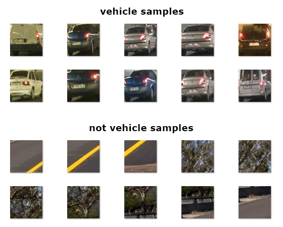
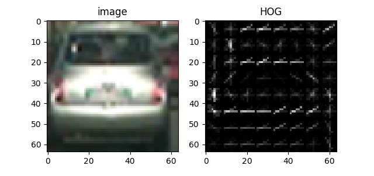
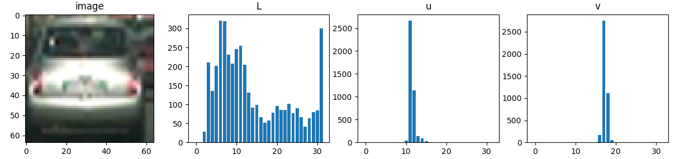
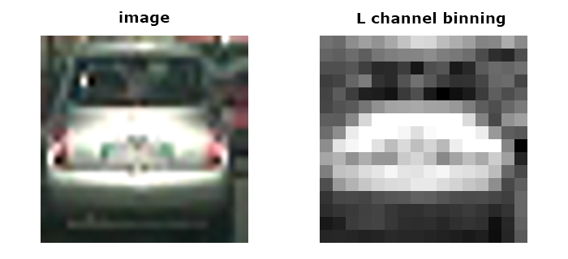
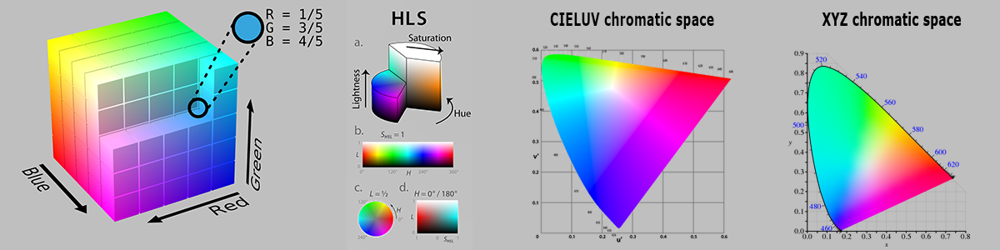

# Vehicle Detection Project

---

## Project Description

The goals / steps of this project are the following:

* Perform a Histogram of Oriented Gradients (HOG) feature extraction on a labeled training set of images and train a classifier Linear SVM classifier
* Optionally, apply a color transform and append binned color features, as well as histograms of color, to your HOG feature vector.
* Implement a sliding-window technique and use your trained classifier to search for vehicles in images.
* Run pipeline on a video stream and create a heat map of recurring detections frame by frame to reject outliers and follow detected vehicles.
* Estimate a bounding box for vehicles detected.

---

### Training Data Set

We were provided with vehicle and non-vehicle images to train the classifier. The images are 64x64 pixels. I have collected some additional samples from the video images to minimize false detections. I ended up with the following number of samples:

* **Vehicle samples:** 8,832
* **Non-vehicle samples:** 9,710

*Vehicle and Non-Vehicle samples from the data set*

---

## Feature Descriptors

### Histogram of Oriented Gradients (HOG)

The [histogram of oriented gradients](https://en.wikipedia.org/wiki/Histogram_of_oriented_gradients) (HOG) is a feature descriptor used in computer vision for object detection.

The idea behind HOG is that an object's shape and appearance can be described by the intensity and direction of its edges. To produce the HOG for an image, the image is divided into cells and for each cell the histogram of gradient directions is calculated. To make the HOG more robust to changes in lighting, cells are combined into blocks and contrast normalized based on the larger areas of the blocks.

*Histogram of Oriented Gradients visualized*

(The HOG function is `hog_features` in `hog.py`.)

---

### Histogram of Image Channels

For image channels a [histogram](https://en.wikipedia.org/wiki/Image_histogram) is calculated by dividing the channel's value range into bins (for example [0:7, 8:15, ..., 248:255]) and for each bin the number of pixels in that range counted.

*Histogram of channels in the CIELUV color space*

(The histogram function is `color_histograms` in `histogram.py`.)

---

### Image Channel Binning

[Image data binning](https://en.wikipedia.org/wiki/Data_binning) is used to reduce the effect of small details in the image. Image channels are divided into bins (for example 4x4 pixels) and the bins are assigned the average value of the pixels they cover.

*4x4 binning of L channel in HLS color space*

(The binning function is `spatial_bin` in `binning.py`.)

---

### Color Spaces

I have experimented with [RGB](https://en.wikipedia.org/wiki/RGB_color_model), [HLS](https://en.wikipedia.org/wiki/HSL_and_HSV), [CIELUV](https://en.wikipedia.org/wiki/CIELUV) and [XYZ](https://en.wikipedia.org/wiki/CIE_1931_color_space) color spaces for feature extraction. I will detail the actual channels used in later sections.

*RGB, HLS, CIELUV and XYZ color spaces (from wikipedia.org)*

---

## HOG/SVM Method

In this method I trained a [support vector machine](https://en.wikipedia.org/wiki/Support_vector_machine) (SVM) classifier with the data set and detected vehicles by sliding a window accross each image and using the trained SVM to predict if a vehicle was present in the window. I used the detected window locations to draw bounding boxes around the vehicles.

---

### Data Preparation

For each image in the data set I used the following features:

| Method        | Color Space | Channel  |
| ------------- | ----------- | -------- |
| Histogram     | RBG         | R        |
| Histogram     | CIELUV      | L        |
| Histogram     | CIELUV      | u        |
| Histogram     | CIELUV      | v        |
| Binning       | CIELUV      |          |
| Binning       | RGB         |          |
| HOG           | CIELUV      | L        |
| HOG           | CIELUV      | u        |
| HOG           | CIELUV      | v        |

I reshaped the features into 1D arrays if necessary and concatenated them.

(The features are prepared in the `combine_features` function of `feat.py` using precalculated features from `hog.py`, `histogram.py` and `binning.py` modules.)

---

### SVM training

I've tested several [sklearn.svm.SVC](http://scikit-learn.org/stable/modules/generated/sklearn.svm.SVC.html) kernel types and parameters and found that the **rbf** kernel with probability estimates enabled gave the best results for classification (most accurate detections with least false positives), however prediction using **rbf** was very slow. I ended up using [sklearn.svm.LinearSVC](http://scikit-learn.org/stable/modules/generated/sklearn.svm.LinearSVC.html) and dealt with false positives after detection.

I trained the SVM to **5,000** iterations and got a test accuracy of **98.62%**.

(The code is in the `main` function of `main.py`.)

---

## [Rubric](https://review.udacity.com/#!/rubrics/513/view) Points
### Here I will consider the rubric points individually and describe how I addressed each point in my implementation.

---
### Writeup / README

#### 1. Provide a Writeup / README that includes all the rubric points and how you addressed each one.  You can submit your writeup as markdown or pdf.  [Here](https://github.com/udacity/CarND-Vehicle-Detection/blob/master/writeup_template.md) is a template writeup for this project you can use as a guide and a starting point.

You're reading it!

### Histogram of Oriented Gradients (HOG)

####1. Explain how (and identify where in your code) you extracted HOG features from the training images.

The code for this step is contained in the first code cell of the IPython notebook (or in lines # through # of the file called `some_file.py`).

I started by reading in all the `vehicle` and `non-vehicle` images.  Here is an example of one of each of the `vehicle` and `non-vehicle` classes:

![alt text][image1]

I then explored different color spaces and different `skimage.hog()` parameters (`orientations`, `pixels_per_cell`, and `cells_per_block`).  I grabbed random images from each of the two classes and displayed them to get a feel for what the `skimage.hog()` output looks like.

Here is an example using the `YCrCb` color space and HOG parameters of `orientations=8`, `pixels_per_cell=(8, 8)` and `cells_per_block=(2, 2)`:

![alt text][image2]

#### 2. Explain how you settled on your final choice of HOG parameters.

I tried various combinations of parameters and...

#### 3. Describe how (and identify where in your code) you trained a classifier using your selected HOG features (and color features if you used them).

I trained a linear SVM using...

### Sliding Window Search

#### 1. Describe how (and identify where in your code) you implemented a sliding window search.  How did you decide what scales to search and how much to overlap windows?

I decided to search random window positions at random scales all over the image and came up with this (ok just kidding I didn't actually ;):

![alt text][image3]

#### 2. Show some examples of test images to demonstrate how your pipeline is working.  What did you do to optimize the performance of your classifier?

Ultimately I searched on two scales using YCrCb 3-channel HOG features plus spatially binned color and histograms of color in the feature vector, which provided a nice result.  Here are some example images:

![alt text][image4]
---

### Video Implementation

####1. Provide a link to your final video output.  Your pipeline should perform reasonably well on the entire project video (somewhat wobbly or unstable bounding boxes are ok as long as you are identifying the vehicles most of the time with minimal false positives.)
Here's a [link to my video result](./project_video.mp4)

####2. Describe how (and identify where in your code) you implemented some kind of filter for false positives and some method for combining overlapping bounding boxes.

I recorded the positions of positive detections in each frame of the video.  From the positive detections I created a heatmap and then thresholded that map to identify vehicle positions.  I then used `scipy.ndimage.measurements.label()` to identify individual blobs in the heatmap.  I then assumed each blob corresponded to a vehicle.  I constructed bounding boxes to cover the area of each blob detected.

Here's an example result showing the heatmap from a series of frames of video, the result of `scipy.ndimage.measurements.label()` and the bounding boxes then overlaid on the last frame of video:

### Here are six frames and their corresponding heatmaps:

![alt text][image5]

### Here is the output of `scipy.ndimage.measurements.label()` on the integrated heatmap from all six frames:
![alt text][image6]

### Here the resulting bounding boxes are drawn onto the last frame in the series:
![alt text][image7]

---

###Discussion

####1. Briefly discuss any problems / issues you faced in your implementation of this project.  Where will your pipeline likely fail?  What could you do to make it more robust?

Here I'll talk about the approach I took, what techniques I used, what worked and why, where the pipeline might fail and how I might improve it if I were going to pursue this project further.

