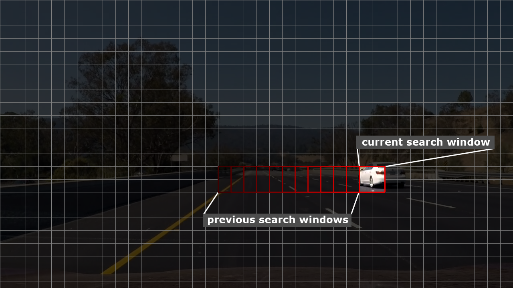

# Vehicle Detection Project

---

## Project Description

The goals / steps of this project are the following:

* Perform a Histogram of Oriented Gradients (HOG) feature extraction on a labeled training set of images and train a classifier Linear SVM classifier
* Optionally, apply a color transform and append binned color features, as well as histograms of color, to your HOG feature vector.
* Implement a sliding-window technique and use your trained classifier to search for vehicles in images.
* Run pipeline on a video stream and create a heat map of recurring detections frame by frame to reject outliers and follow detected vehicles.
* Estimate a bounding box for vehicles detected.

---

### Training Data Set

We were provided with vehicle and non-vehicle images to train the classifier. The images are 64x64 pixels. I have collected some additional samples from the video images to minimize false detections. I ended up with the following number of samples:

* **Vehicle samples:** 8,832
* **Non-vehicle samples:** 9,710

*Vehicle and Non-Vehicle samples from the data set*

---

## Feature Descriptors

### Histogram of Oriented Gradients (HOG)

The [histogram of oriented gradients](https://en.wikipedia.org/wiki/Histogram_of_oriented_gradients) (HOG) is a feature descriptor used in computer vision for object detection.

The idea behind HOG is that an object's shape and appearance can be described by the intensity and direction of its edges. To produce the HOG for an image, the image is divided into cells and for each cell the histogram of gradient directions is calculated. To make the HOG more robust to changes in lighting, cells are combined into blocks and contrast normalized based on the larger areas of the blocks.

*Histogram of Oriented Gradients visualized*

(The HOG function is `hog_features` in `hog.py`.)

---

### Histogram of Image Channels

For image channels a [histogram](https://en.wikipedia.org/wiki/Image_histogram) is calculated by dividing the channel's value range into bins (for example [0:7, 8:15, ..., 248:255]) and for each bin the number of pixels in that range counted.

*Histogram of channels in the CIELUV color space*

(The histogram function is `color_histograms` in `histogram.py`.)

---

### Image Channel Binning

[Image data binning](https://en.wikipedia.org/wiki/Data_binning) is used to reduce the effect of small details in the image. Image channels are divided into bins (for example 4x4 pixels) and the bins are assigned the average value of the pixels they cover.

*4x4 binning of L channel in HLS color space*

(The binning function is `spatial_bin` in `binning.py`.)

---

### Color Spaces

I have experimented with [RGB](https://en.wikipedia.org/wiki/RGB_color_model), [HLS](https://en.wikipedia.org/wiki/HSL_and_HSV), [CIELUV](https://en.wikipedia.org/wiki/CIELUV) and [XYZ](https://en.wikipedia.org/wiki/CIE_1931_color_space) color spaces for feature extraction. I will detail the actual channels used in later sections.

*RGB, HLS, CIELUV and XYZ color spaces (from wikipedia.org)*

---

## Sliding Window HOG Method

In this method I trained a [support vector machine](https://en.wikipedia.org/wiki/Support_vector_machine) (SVM) classifier with the data set and detected vehicles by sliding a window accross each image and using the trained SVM to predict if a vehicle was present in the window. I used the detected window locations to draw bounding boxes around the vehicles.

---

### Data Preparation

For each image in the data set I used the following features:

| Method        | Color Space | Channel  |
| ------------- | ----------- | -------- |
| Histogram     | RBG         | R        |
| Histogram     | CIELUV      | L        |
| Histogram     | CIELUV      | u        |
| Histogram     | CIELUV      | v        |
| Binning       | CIELUV      |          |
| Binning       | RGB         |          |
| HOG           | CIELUV      | L        |
| HOG           | CIELUV      | u        |
| HOG           | CIELUV      | v        |

For each sample I reshaped the features into 1D arrays if necessary and concatenated them.

I also created an array of corresponding labels, **1** denoting vehicle features, **0** for non-vehicles.

The shape of the training data:

* **X** (features): (18542, 10976)
* **y** (labels): (18542, )

(The features are prepared in the `combine_features` function of `feat.py` using precalculated features from `hog.py`, `histogram.py` and `binning.py` modules.)

---

### SVM training

I've tested several [sklearn.svm.SVC](http://scikit-learn.org/stable/modules/generated/sklearn.svm.SVC.html) kernel types and parameters and found that the **rbf** kernel with probability estimates enabled gave the best results for classification (most accurate detections with least false positives), however prediction using **rbf** was very slow. I ended up using [sklearn.svm.LinearSVC](http://scikit-learn.org/stable/modules/generated/sklearn.svm.LinearSVC.html) and dealt with false positives after detection.

I trained the SVM to **5,000** iterations and got a test accuracy of **98.62%**.

(The SVM training code is in the `main` function of `main.py`.)

---

### Sliding Window Search

I used a sliding window to find regions of the video frames that contain vehicles. I used a window size of (64, 64), which is the size of the SVM training samples. To create the stride for the search, I divided the video frame into a grid. For each grid point I extracted a subimage in the shape of the search window.

*(64, 64) search window (red square) moving horizontally across the image with (32, 32) stride (previous search windows overlap due to stride)*

The stride in the actual implementation is based on the HOG cell size. This allows the HOG to be calculated once for the whole frame and the HOG features extracted for the subimage to save processing time.

For each window the same feature types are calculated and concatenated as in the training data preparation step.

The resulting feature vector is evaluated by the trained SVM (`sklearn.svm.LinearSVC.predict` function). If the classifier predicts a vehicle, that region is saved in a list of detections.

To match larger and smaller regions than the (64, 64) window, additional sliding window searches are performed on the video frame where the video frame is scaled down (for larger regions) or up (for smaller regions). For example, to predict (128, 128) regions, the video frame is scaled to 50% of it's original size ( (1280, 720) -> (640, 360) ) and searched with the default (64, 64) window size.

I have used a combination of these search sizes:

| Search Size |
| ----------- |
| (48, 48)    |
| (64, 64)    |
| (80, 80)    |
| (96, 96)    |
| (112, 112)  |
| (128, 128)  |
| (144, 144)  |
| (160, 160)  |

The sliding window search is implemented in the `slide_windows` function of the `classify.py` module.

---

### Finding Vehicle Regions

For each vehicle the sliding window search results in multiple detections.

*All detections for a frame.*

To find the bounding box of the detections, the detected regions are added to a heatmap. To remove low confidence detections, low areas of the heatmap are discarded (`HeatMap.threshold` function in `heatmap.py`). The distinct regions in the heatmap are labeled using [`scipy.ndimage.measurements.label`](https://docs.scipy.org/doc/scipy-0.16.0/reference/generated/scipy.ndimage.measurements.label.html). As a last step a bounding box is drawn for each labeled area.

*Detected bounding box and corresponding heatmap.*

The heatmap functions are implemented in the `heatmap.py` module.

---

### False Detections

I've used several method to eliminate false detections.

* The classifier has a hard time with really dark windows. I discard windows where the average lightness intensity is below a certain level.

* Only the region below the horizon is searched.

* Labeled areas with small very small sizes are discarded.

* For each frame I add the detections from a range of previous frame. This allows detection of false positives that appear for a short period of time and also smoothes the calculated bounding box.

*Detections from a range of 16 frames (blue) and calculated bounding box (red) after thresholding.*

---

### Future Enhancements

My current pipeline is slow, so it wouldn't work in a real time application. Possible optimizations:

* Test if less feature types would be sufficient.
* Test other color spaces.
* Further adjust HOG parameters to try to speed up HOG calculation.
* Use multiple processes for sliding window search.
* Track detected areas and in subsequent frames search only that region.
* Use less window size passes for sliding window search.

---

## Deep Learning Convolution Method

During this term we've used [convolutional neural networks](https://en.wikipedia.org/wiki/Convolutional_neural_network)  to classify traffic signs with pretty good accuracy. I decided to try using a CNN to classify vehicle regions in the video frames.

I've found several papers on the internet about using CNNs for image segmentation and classification. Examples: [Fully Convolutional Networks for Semantic Segmentation](https://people.eecs.berkeley.edu/~jonlong/long_shelhamer_fcn.pdf), [Fast Image Scanning with
Deep Max-Pooling Convolutional Neural Networks](https://arxiv.org/pdf/1302.1700.pdf).

Convolutional layers automatically scan the images similar to the sliding window approach.

---

### Model

I setup a model with the input size of our training samples (64, 64, 3) using `Convolution2D` layers. I labeled the vehicle images **1** and the non-vehicle images **-1** and used `tanh` as the activation function on the last convolutional layers that has an output range of [-1..1]. The output layer is a `Flatten` layer that converts the output shape of the last `Convolution2D` layer from (1, 1, 1) to (1,). I trained the network to classify the samples and saved the weights.

*A simplified model with two convolutional layers.*

My training model uses the following layers:

| layer | parameters  | output shape |
| ----- | ----------- | ------------ |
|Conv2D|depth: 8, stride: (3, 3), activation: elu|(64, 64, 8)|
|Conv2D|depth: 16, stride: (3, 3), activation: elu|(64, 64, 16)|
|MaxPooling2D|pool size: (8, 8), stride: (8, 8)|(8, 8, 16)|
|Dropout|rate: 0.30|(8, 8, 16)|
|Conv2D|depth: 128, stride: (8, 8), activation: elu|(1, 1, 128)|
|Dropout|rate: 0.30|(1, 1, 128)|
|Conv2D|depth: 1, stride: (1, 1), activation: tanh|(1, 1, 1)|
|Flatten||(1,)|

For prediction I used the same model with input shape of (None, None, 3) without the `Flatten` layer because we want to use the output of the last `Convolution2D`. This model uses the weights saved from the trained model.

My prediction model uses the following layers:

| layer | parameters  | output shape |
| ----- | ----------- | ------------ |
|Conv2D|depth: 8, stride: (3, 3), activation: elu|(None, None, 8)|
|Conv2D|depth: 16, stride: (3, 3), activation: elu|(None, None, 16)|
|MaxPooling2D|pool size: (8, 8), stride: (8, 8)|(None, None, 16)|
|Dropout|rate: 0.20|(None, None, 16)|
|Conv2D|depth: 128, stride: (8, 8), activation: elu|(None, None, 128)|
|Dropout|rate: 0.20|(None, None, 128)|
|Conv2D|depth: 1, stride: (1, 1), activation: tanh|(None, None, 1)|

---

### Preprocessing and Training

I used the same data to train the model:

* **Vehicle samples:** 8,832
* **Non-vehicle samples:** 9,710

I converted the sample images to [CIELUV](https://en.wikipedia.org/wiki/CIELUV) color space.

I trained the model using the [mean squared error](https://keras.io/losses/) loss function with the [Adam](https://keras.io/optimizers/) optimizer and split **20%** of the samples for validation. The model trained for **16** epochs, reshuffling the samples between epochs. The final validation accuracy is **99.35%**.

---

### Prediction

The output of the model is a grid with prediction values corresponding to areas in the video frames. Values close to **1** indicate areas of vehicles.

*Output of model (left) and detected vehicle regions (right).*

The detections are then added to a heatmap, thresholded and bounding boxes for the vehicles are drawn using the same process as in the sliding window method.

*Detected vehicle bounding boxes.*

The deep learning method is implemented in `dl.py` and uses the same `heatmap.py` module and some utility functions from `utils.py`.

---

## Results

### Sliding Window HOG Method

### Deep Learning Convolution Method

### Comparison

While this lesson focused on using HOG features with a sliding window search, I've found that the deep learning CNN method was easier to implement because convolutional layers perform a sliding window approach on their own. The deep learning network required using a single color space and processed images about 100x faster than my HOG implementation (although my HOG code has many areas where it can be optimized). I've also found that the deep learning method resulted in less false detections.

---

## Submission

### Python Files

| File        | Description                   |
| ----------- | -----------------------       |
|constants.py | project constants             |
|utils.py     | utility functions             |
|binning.py   | image binning features        |
|histogram.py | image histogram features      |
|hog.py       | image hog features            |
|classify.py  | hog sliding window detection  |
|feat.py      | feature preprocessing         |
|heatmap.py   | heatmap class                 |
|main.py      | hog processing main file      |
|dl.py        | deep learning processing main |

### Video files

| File                 | Description                   |
| -----------          | -----------------------       |
|project_video_hog.mp4 | sliding window hog method     |
|project_video_dl.mp4  | deep learning CNN method      |

---